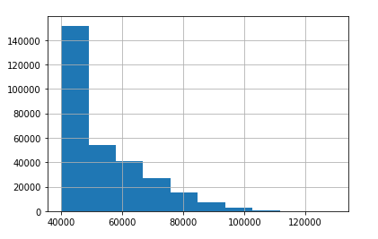
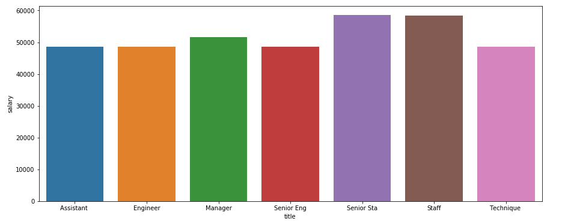
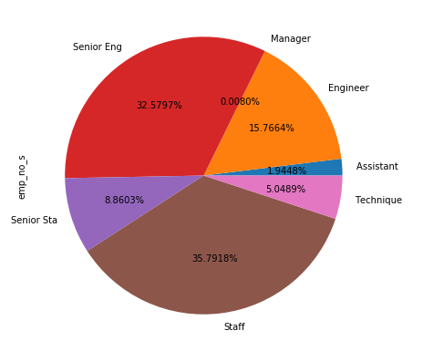
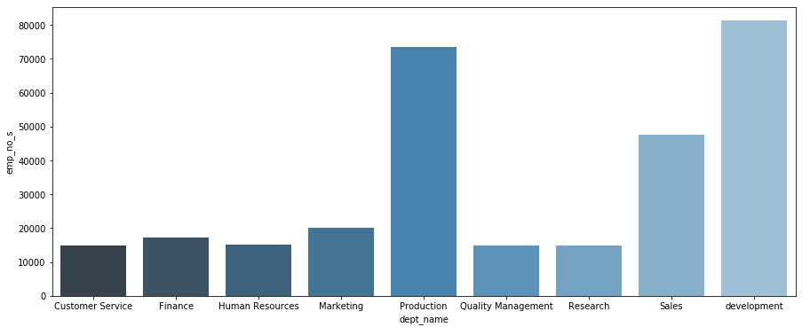
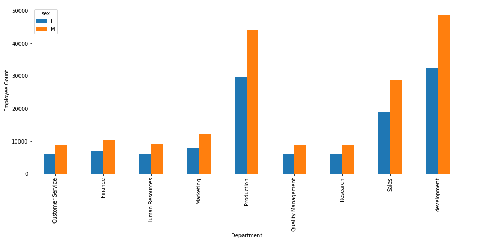
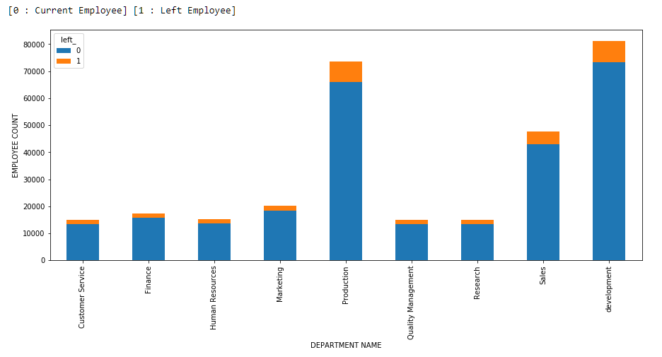
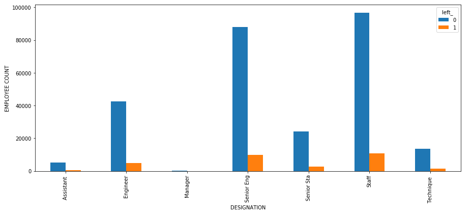
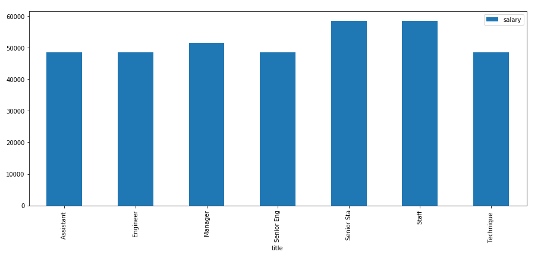
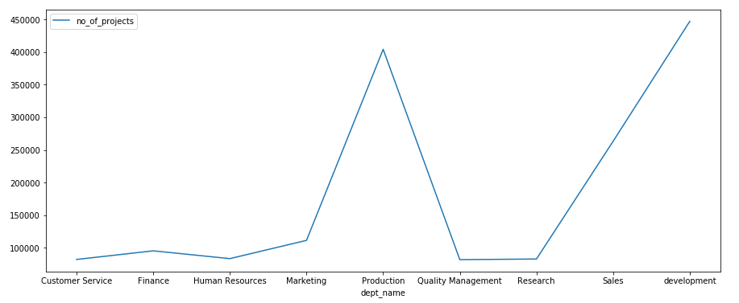

# -----------------------------------Data Engineering Capstone Project-----------------------------------
## Business Objectives
- Exploratory Data Analysis of provided Data Set.
- Using the data set to come up with meaningful insights.
- Using Machine Learning to come up with the various reasons for the employees leaving the company.
## Technology Stack:
- MySQL (to create database)
- Linux Commands
- Sqoop (Transfer data from MySQL Server to HDFS/Hive)
- HDFS (to store the data)
- Hive (to create database)
- Impala (to perform the EDA)
- SparkSQL (to perform the EDA)
## Data Modeling

- Inspect the CSVs and sketch out an ERD of the tables.


## Data Engineering

- Using the data informations i create a table schema for each of the six CSV files as well as load the data.

```Mysql
DROP TABLE IF EXISTS DEPARTMENT;
-- Create DEPARTMENT Table
CREATE TABLE DEPARTMENT(dept_no varchar(20) NOT NULL,dept_name varchar(20),PRIMARY KEY(dept_no));

-- Load departments.csv file into the DEPARTMENT Table
LOAD DATA LOCAL INFILE  '/home/anabig114217/departments.csv'
INTO TABLE DEPARTMENT
FIELDS TERMINATED BY ',' ENCLOSED BY '"'
IGNORE 1 ROWS;

DROP TABLE IF EXISTS DEPT_EMPLOYEE;
-- Create DEPT_EMPLOYEE Table
CREATE TABLE DEPT_EMPLOYEE(emp_no int NOT NULL,dept_no varchar(10), PRIMARY KEY(emp_no));

-- Load dept_emp.csv file into the DEPT_EMPLOYEE Table
LOAD DATA LOCAL INFILE  '/home/anabig114217/dept_emp.csv'
INTO TABLE DEPT_EMPLOYEE
FIELDS TERMINATED BY ',' ENCLOSED BY '"'
IGNORE 1 ROWS;

DROP TABLE IF EXISTS DEPT_MANAGER;
-- Create DEPT_MANAGER Table
CREATE TABLE DEPT_MANAGER(dept_no varchar(10),emp_no int);

-- Load dept_manager.csv file into the DEPT_MANAGER Table
LOAD DATA LOCAL INFILE  '/home/anabig114217/dept_manager.csv'
INTO TABLE DEPT_MANAGER
FIELDS TERMINATED BY ',' ENCLOSED BY '"'
IGNORE 1 ROWS;

DROP TABLE IF EXISTS EMPLOYEES;
-- Create EMPLOYEES Table
CREATE TABLE EMPLOYEES(emp_no int NOT NULL,emp_title_id VARCHAR(10),birth_date VARCHAR(12),
first_name VARCHAR(15),last_name VARCHAR(15),sex CHAR(2),
hire_date VARCHAR(12),no_of_projects int,Last_performance_rating VARCHAR(5)
,left_ VARCHAR(10),last_date VARCHAR(12),PRIMARY KEY(emp_no));

-- Load employees.csv file into the EMPLOYEES Table
LOAD DATA LOCAL INFILE  '/home/anabig114217/employees.csv'
INTO TABLE EMPLOYEES
FIELDS TERMINATED BY ',' ENCLOSED BY '"'
IGNORE 1 ROWS;

DROP TABLE IF EXISTS SALARIES;
-- Create SALARIES Table
CREATE TABLE SALARIES(emp_no int,salary INT,PRIMARY KEY(emp_no));

-- Load salaries.csv file into the SALARIES Table
LOAD DATA LOCAL INFILE  '/home/anabig114217/salaries.csv'
INTO TABLE SALARIES
FIELDS TERMINATED BY ',' ENCLOSED BY '"'
IGNORE 1 ROWS;

DROP TABLE IF EXISTS TITLES;
-- Create TITLES Table
CREATE TABLE TITLES(title_id VARCHAR(10),title VARCHAR(10),PRIMARY KEY(title_id));

-- Load titles.csv file into the TITLES Table
LOAD DATA LOCAL INFILE  '/home/anabig114217/titles.csv'
INTO TABLE TITLES
FIELDS TERMINATED BY ',' ENCLOSED BY '"'
IGNORE 1 ROWS;


ALTER TABLE "EMPLOYEES" ADD CONSTRAINT "emp_tbl_titl_tbl" FOREIGN KEY("emp_title_id")
REFERENCES "TITLES" ("title_id");

ALTER TABLE "DEPT_MANAGER" ADD CONSTRAINT "dept_manager_tbl_dept_tbl" FOREIGN KEY("dept_no")
REFERENCES "DEPARTMENT" ("dept_no");

ALTER TABLE "DEPT_MANAGER" ADD CONSTRAINT "dept_manager_tbl_emp_tbl" FOREIGN KEY("emp_no")
REFERENCES "EMPLOYEES" ("emp_no");

ALTER TABLE "SALARIES" ADD CONSTRAINT "salaries_tbl_emp_tbl" FOREIGN KEY("emp_no")
REFERENCES "EMPLOYEES" ("emp_no");

ALTER TABLE "DEPT_EMPLOYEE" ADD CONSTRAINT "dept_emp_tbl_emp_tbl" FOREIGN KEY("emp_no")
REFERENCES "EMPLOYEES" ("emp_no");

ALTER TABLE "DEPT_EMPLOYEE" ADD CONSTRAINT "dept_emp_tbl_dept_tbl" FOREIGN KEY("dept_no")
REFERENCES "DEPARTMENT" ("dept_no");
```

## Sqoop

- Sqoop job to transfer the data from MySQL to HDFS and stored in Parquet format

``` Sqoop
sqoop import-all-tables --connect jdbc:mysql://ip-10-1-1-204.ap-south-1.compute.internal:3306/anabig114217 
--username anabig114217 --password Bigdata123 --as-parquetfile --warehouse-dir /user/anabig114217/prasad_ca 
--m 1 --driver com.mysql.jdbc.Driver
```
## Hive
- Create database in Hive as per the above ER Diagram and load the data into Hive tables.

``` Hive
DROP DATABASE IF EXISTS finalproject;

CREATE DATABASE finalproject;

USE finalproject;

DROP TABLE IF EXISTS department_prkt;
Create external Table department_prkt (dept_no varchar(20) ,dept_name varchar(20))
STORED AS PARQUET LOCATION "/user/anabig114217/parquetfinalproject/DEPARTMENT";

DROP TABLE IF EXISTS dept_employee_prkt;
CREATE external TABLE dept_employee_prkt(emp_no int,dept_no varchar(10))
STORED AS PARQUET LOCATION "/user/anabig114217/parquetfinalproject/DEPT_EMPLOYEE";

DROP TABLE IF EXISTS dept_manager_prkt;
CREATE TABLE dept_manager_prkt(dept_no varchar(10),emp_no int)
STORED AS PARQUET LOCATION "/user/anabig114217/parquetfinalproject/DEPT_MANAGER";

DROP TABLE IF EXISTS employees_prkt;
CREATE external TABLE employees_prkt(emp_no int ,emp_title_id VARCHAR(10),birth_date VARCHAR(12)
,first_name VARCHAR(15),last_name VARCHAR(15),sex CHAR(2),hire_date VARCHAR(12),no_of_projects int
,Last_performance_rating VARCHAR(5),left_ VARCHAR(10),last_date VARCHAR(12))
STORED AS PARQUET LOCATION "/user/anabig114217/parquetfinalproject/EMPLOYEES";

DROP TABLE IF EXISTS salaries_prkt;
CREATE external TABLE salaries_prkt(emp_no int,salary INT)
STORED AS PARQUET LOCATION "/user/anabig114217/parquetfinalproject/SALARIES";

DROP TABLE IF EXISTS titles_prkt;
CREATE external TABLE titles_prkt(title_id VARCHAR(10),title VARCHAR(10))
STORED AS PARQUET LOCATION "/user/anabig114217/parquetfinalproject/TITLES";

--Final Employee table have the updated date type format columns
DROP TABLE IF EXISTS final_empoyees_prkt;
create table final_empoyees_prkt as 
select emp_no,emp_title_id,FROM_UNIXTIME( UNIX_TIMESTAMP(birth_date,'M/d/yyyy')) as  birth_date,
first_name,last_name,sex,
FROM_UNIXTIME( UNIX_TIMESTAMP(hire_date,'M/d/yyyy')) as hire_date,
no_of_projects,last_performance_rating,left_,
FROM_UNIXTIME( UNIX_TIMESTAMP(last_date,'M/d/yyyy')) as last_date from employees_prkt;

```
## Data Analysis using Impala
### Work on Exploratory data analysis as per the requirement using Impala.
``` Impala
use finalproject;
```
- A list showing employee number, last name, first name, sex, and salary for each employee.
``` Impala
select A.emp_no,last_name,first_name ,B.salary from employees_prkt A 
inner join salaries_prkt B on A.emp_no = B.emp_no;
```
- A list showing first name, last name, and hire date for employees who were hired in 1986.
``` Impala
select first_name,last_name,
FROM_UNIXTIME( UNIX_TIMESTAMP(hire_date,'M/d/yyyy'),'dd-MMM-yyyy') from employees
where year(FROM_UNIXTIME( UNIX_TIMESTAMP(hire_date,'M/d/yyyy'))) = 1986 ;
```
- A list showing the manager of each department with the following information: department number, department name,  the manager's employee number, last name, first name.
``` Impala
select dept_no,dept_name,manager_emp_no, last_name,first_name from employees D inner join 
(select A.dept_no,A.dept_name,B.emp_no AS manager_emp_no 
from department A inner join dept_manager B on A.dept_no = B.dept_no) F
on D.emp_no = F.manager_emp_no;
```
- A list showing the department of each employee with the following information:employee number, last name, first name, and department name.
``` Impala
select dept_no,dept_name,D.emp_no, last_name,first_name from employees D inner join 
(select A.dept_no,A.dept_name,B.emp_no 
from department A inner join dept_employee B on A.dept_no = B.dept_no) F
on D.emp_no = F.emp_no;
```
- A list showing first name, last name, and sex for employees whose first name is 'Hercules' and last names begin with 'B'.
``` Impala
select first_name,last_name,sex from employees
where first_name like "Hercules" and  last_name like 'B%';
```
- A list showing all employees in the Sales department,including their employee number, last name, first name, and department name.
``` Impala
select A.emp_no,last_name,first_name,dept_name from employees A inner join
(select B.emp_no,B.dept_no,C.dept_name from dept_employee B inner join department C on B.dept_no = C.dept_no) D
on A.emp_no = D.emp_no
where dept_name like 'Sales';
```
- A list showing all employees in the Sales and Development departments, including their employee number, last name, first name, and department name.
``` Impala
select A.emp_no,last_name,first_name,dept_name from employees A inner join
(select B.emp_no,B.dept_no,C.dept_name from dept_employee B inner join department C on B.dept_no = C.dept_no) D
on A.emp_no = D.emp_no
where dept_name in ('Sales','development');
```
- A list showing the frequency count of employee last names, in descending order. ( i.e., how many employees share each last name.
``` Impala
select last_name,count(last_name) as count_of_employee from employees
group by last_name;
```
- Calculate employee tenure & show the tenure distribution among the employees.
``` Impala
select "[NOTE:This dataset contains data from 1985 to 2000]";

select emp_no,hire_date,last_date,
case when last_date is null then 2000 - year(hire_date) else  year(last_date)-year(hire_date) end as Tenure
from final_empoyees;
```

### Own Analysis 

- Average salary of employees
``` Impala
select avg(salary) from salaries;
```
- Deepartment wise employee count
``` Impala
select * from department
```
- Male and Female employee count
``` Impala
select sex,count(emp_no) as employee_cnt from employees
group by sex;
```
- Deepartment wise project
``` Impala
select dept_name,sum(no_of_projects) as total_project from employees A inner join 
(select B.emp_no,C.dept_no,C.dept_name from dept_employee B inner join department C
on B.dept_no = C.dept_no) D  on A.emp_no = D.emp_no
group by dept_name;
```
## Data Analysis Using Spark
``` Pyspark
from pyspark.sql import SQLContext
from pyspark import SparkContext
from pyspark.sql.functions import *
from pyspark.sql.window import Window 
from pyspark.sql.functions import 
from pyspark.sql.functions import unix_timestamp,from_unixtime,trim,to_date,translate 
from pyspark.mllib.stat import Statistics 
import numpy as np 
import pandas as pd 
import matplotlib.pyplot as plt
import seaborn as sns

sc = SparkContext('local','Spark SQL');
Sqlcontext = SQLContext(sc);
```
#### Create DataFrames
``` Pyspark
department = Sqlcontext.read.parquet("hdfs://nameservice1/user/anabig114217/parquetfinalproject/DEPARTMENT/2790c4c4-6b48-4314-912d-20ad05b2a7a6.parquet");

dept_employee = Sqlcontext.read.parquet("hdfs://nameservice1/user/anabig114217/parquetfinalproject/DEPT_EMPLOYEE/6062f2bb-5746-4cff-9506-c1423e046206.parquet");

dept_manager = Sqlcontext.read.parquet("hdfs://nameservice1/user/anabig114217/parquetfinalproject/DEPT_MANAGER/9d69689d-1693-4a2c-997b-31d94942736e.parquet");

employees = Sqlcontext.read.parquet("hdfs://nameservice1/user/anabig114217/parquetfinalproject/EMPLOYEES/10670362-07fc-4469-84f0-ab82dac80c8e.parquet");

salaries = Sqlcontext.read.parquet("hdfs://nameservice1/user/anabig114217/parquetfinalproject/SALARIES/763b73b6-8810-4750-9980-af5108f60190.parquet");

titles = Sqlcontext.read.parquet("hdfs://nameservice1/user/anabig114217/parquetfinalproject/TITLES/adee0c6d-283f-4521-a9d1-1f0e14eb4220.parquet");
```

### Exploratory Data Analysis
``` Python
salaries.show(2);
salaries.toPandas().info();

dept_employee.show(3);
# Info About the Df
dept_employee.toPandas().info();

dept_manager.show(2);
# Info About the Df
dept_manager.toPandas().info();

employees.show(2);
# Info About the Df
employees.toPandas().info();

titles.show(2);
# Info About the Df
titles.toPandas().info();

# Rename Few Columns
department = department.withColumnRenamed("dept_no","dp_dept_no")
dept_employee = dept_employee.withColumnRenamed("dept_no","de_dept_no")
dept_employee = dept_employee.withColumnRenamed("emp_no","de_emp_no")
dept_manager = dept_manager.withColumnRenamed("emp_no","dm_emp_no")
dept_manager = dept_manager.withColumnRenamed("dept_no","dm_dept_no")
salaries = salaries.withColumnRenamed("emp_no",'sl_emp_no')
employees = employees.withColumnRenamed("emp_no","emp_no_s")

#Update The Date columns with proper format
employees = employees.withColumn('birth_date',to_date('birth_date','M/d/yyyy')).withColumn('last_date',to_date('last_date','M/d/yyyy'))
                        .withColumn('hire_date',to_date('hire_date','M/d/yyyy'))


# Merge data frame
emp_df = employees.join(titles,employees.emp_title_id == titles.title_id,"rightouter") \
                    .join(dept_employee,employees.emp_no_s == dept_employee.de_emp_no,"rightouter") \
                    .join(salaries,employees.emp_no_s == salaries.sl_emp_no,"rightouter") \
                    .join(department,dept_employee.de_dept_no==department.dp_dept_no,"rightouter")
```
- A list showing employee number, last name, first name, sex, and salary for each employee
```Pyspark
emp_df.select("emp_no_s","last_name","first_name","sex","salary").show()
```
-  A list showing first name, last  name, and hire date for employees who were hired in 1986.
```Pyspark
emp_df.where(year('hire_date') == 1986).select("emp_no_s","last_name","first_name","hire_date").show()
```
- A list showing the manager of each department with the bellow information: 
- department number,department name, the manager's employee number, last name, first name
```Pyspark
department.join(dept_manager,department.dp_dept_no == dept_manager.dm_dept_no,"rightouter") \
            .join(employees,dept_manager.dm_emp_no == employees.emp_no_s,"inner") \
            .select("dm_dept_no","dept_name","emp_no_s","last_name","first_name").show() 
```
- A list showing the department of each employee with the following information: employee number, last name, first name, and department name.
```Pyspark
department.join(dept_employee,department.dp_dept_no == dept_employee.de_dept_no,"rightouter") \
            .join(employees,dept_employee.de_emp_no == employees.emp_no_s,"inner") \
            .select("emp_no_s","last_name","first_name","dept_name").show()
```
- A list showing first name, last name, and sex for employees whose first name is "Hercules" and last names begin with "B.“
```Pyspark
employees.where((employees.first_name == "Hercules") & (employees.last_name.startswith("B"))).show()
```
- A list showing all employees in the Sales department, including their employee number, last name, first name, anddepartment name.
```Pyspark
emp_df.where(emp_df.dept_name == 'Sales').select('emp_no_s','last_name','first_name','dept_name').show()
```
- A list showing all employees in the Sales and Development departments, including their employee number, last name, first name, and department name
```Pyspark
emp_df.where((emp_df.dept_name == 'Sales') | (emp_df.dept_name == 'Development')).select('emp_no_s','last_name','first_name','dept_name').show()
```
- A list showing the frequency count of employee last names, in descending order. ( i.e., how many employees share each last name
```Pyspark
emp_df.sort(emp_df.last_name.desc()).groupBy('last_name').count().show()
```
- Calculate employee tenure & show the tenure distribution among the employees.
```Pyspark
emp_df.createTempView("emp_tbl")
Sqlcontext.sql("""select emp_no_s,hire_date,last_date, \
            case when last_date is null then 2000 - year(hire_date) else  year(last_date)-year(hire_date) end as Tenure from emp_tbl""").show()
```
- Max, min, avg of salaries.
```Pyspark
emp_df.select(max('salary').alias('Max Salary'),min('salary').alias('Min Salary'),mean('salary').alias('Average Salary')).show()
```
## Visualization Using Python Bonous(Optional)

- Convert the Pyspark Dataframe to Pandas Dataframe for Visualization
```Pyspark
emp_pd_df = emp_df.select('emp_no_s','sex','no_of_projects','Last_performance_rating','left_','title','de_dept_no',
                          'salary','dept_name').toPandas()
```
- Histogram to show the salary distribution among the employees
``` Python
emp_pd_df.salary.hist(bins = 10)
```

- Bar graph to show the Average salary per title (designation)
``` Python
data_table = emp_pd_df.pivot_table(index='title',values = 'salary',aggfunc= 'mean').reset_index()
plt.figure(figsize=(15,6))
sns.barplot(data = data_table,x='title',y='salary')
plt.show()
```

- Percentage distribution of employees as per the Designation
``` Python
emp_pd_df.groupby('title')['emp_no_s'].agg('count').plot(kind='pie',subplots=True,figsize=(12,7),autopct = '%1.4f%%')
plt.show()
```

- Department wise employee count.
``` Python
data_table = emp_pd_df.pivot_table(index='dept_name',values = 'emp_no_s',aggfunc= 'count').reset_index()
plt.figure(figsize=(15,6))
sns.barplot(data = data_table,x='dept_name',y='emp_no_s',palette="Blues_d")
plt.show()
```

- Gender wise employee count for different deepartments
``` Python
output1 = emp_pd_df.pivot_table(index='dept_name', columns='sex', values='emp_no_s', aggfunc='count')
output1.plot(kind='bar',figsize=(10,4))
plt.xlabel("Department")
plt.ylabel("Employee Count")
```

- Department wise Left and working Employee.
``` Python
print("[0 : Current Employee] [1 : Left Employee]")
emp_pd_df.pivot_table(index='dept_name',columns='left_',values = 'emp_no_s',aggfunc= 'count').plot(kind='bar',figsize=(15,6),stacked=True)
plt.ylabel('EMPLOYEE COUNT')
plt.xlabel('DEPARTMENT NAME')
plt.show()
```

- Analyse working vs left employes from different designations.
``` Python
emp_pd_df.pivot_table(index='title',columns='left_',values = 'emp_no_s',aggfunc= 'count').plot(kind='bar',figsize=(15,6))
plt.ylabel('EMPLOYEE COUNT')
plt.xlabel('DESIGNATION')
plt.show()
```

- Average salary designation wise.
``` Python
emp_pd_df.pivot_table(index ='title',values ='salary',aggfunc = 'mean').plot(kind='bar',figsize=(15,6))
```

- Department wise number of projects
``` Python
emp_pd_df.pivot_table(index='dept_name',values = 'no_of_projects',aggfunc= 'sum').plot(kind='bar',figsize=(15,6))
plt.show()
```

## Predictive Model using Logistic Regression
### Feature Engineering
``` Pyspark
#SELECT FEW COLUMNS FOR MY MODEL
emp_df_final = emp_df.select('de_dept_no','sex','salary','no_of_projects','left_','birth_date')

# Create a new column called "age" to calculate the age of employees
emp_df_final = emp_df_final.withColumn('age',2000-year('birth_date'))

# Drop The birth date column
emp_df_final = emp_df_final.drop("birth_date")

from pyspark.ml.feature import OneHotEncoder, StringIndexer, VectorAssembler, PolynomialExpansion, VectorIndexer,OneHotEncoderEstimator

#Columns that will be used as features
continuous_features = ['salary', 'no_of_projects','age']
categorical_features = ['de_dept_no', 'sex']

# create object of StringIndexer class and specify input and output column
SI_de_dept = StringIndexer(inputCol='de_dept_no',outputCol='de_dept_Index')
SI_sex = StringIndexer(inputCol='sex',outputCol='sex_Index')


# transform the data
emp_df_final = SI_de_dept.fit(emp_df_final).transform(emp_df_final)
emp_df_final = SI_sex.fit(emp_df_final).transform(emp_df_final)

# view and transform the data
emp_df_final.show(2)

# create object and specify input and output column
OHE = OneHotEncoderEstimator(inputCols=['de_dept_Index', 'sex_Index'],outputCols=['de_dept_Ohe', 'sex_Ohe'])
# transform the data
emp_df_final = OHE.fit(emp_df_final).transform(emp_df_final)

# view and transform the data
emp_df_final.show(2)
```
### Preparing for model building
- The dataframe need to have two columns: features and label
- The vector columns need to named as features
- The target variable need to be named as label
- Then the dataframe can be directly fed to a model to learn
``` Pyspark
featurecols = continuous_features + ['de_dept_Ohe', 'sex_Ohe']

# Feature Column
assembler = VectorAssembler(inputCols=featurecols,outputCol="features")

emp_df_final = assembler.transform(emp_df_final)

#Label Column

emp_df_final = emp_df_final.withColumnRenamed("left_",'label')
emp_df_final = emp_df_final.withColumn("label",emp_df_final.label.cast('int'))

# Test and Train data
train_df,test_df = emp_df_final.randomSplit( [0.7, 0.3], seed = 42 )

#Build the Linear Regression Model
from pyspark.ml.classification import LogisticRegression 

logrg = LogisticRegression(featuresCol= 'features',labelCol='label',maxIter=5)
lr = logrg.fit(train_df)
lr.intercept
lr.coefficients
lr.coefficients
y_pred_test = lr.transform(test_df)
y_pred_train = lr.transform(train_df)
y_pred_train.select('features','label','rawPrediction','probability','prediction').toPandas().head()

from pyspark.ml.evaluation import BinaryClassificationEvaluator
evaluator = BinaryClassificationEvaluator()
evaluator.evaluate(y_pred_test)

#Accuracy
y_pred_test.filter(y_pred_test.label == y_pred_test.prediction).count() / float(y_pred_test.count())

```
### PipeLine

``` Pyspark
from pyspark.ml.feature import StringIndexer, OneHotEncoder, VectorAssembler
from pyspark.ml import Pipeline
from pyspark.ml.classification import LogisticRegression

## Create indexers for the categorical features
indexers = [StringIndexer(inputCol=c, outputCol="{}_idx".format(c)) for c in categorical_features]

## encode the categorical features
encoders = [ OneHotEncoder(
      inputCols=idx.getOutputCol(),
      outputCols="{0}_enc".format(idx.getOutputCol())) for idx in indexers]

## Create vectors for all features categorical and continuous

assembler = VectorAssembler(
  inputCols=[enc.getOutputCol() for enc in encoders] + continuous_features,
  outputCol="features")

## Initialize the linear model
lrModel = LinearRegression( maxIter = 10 )


## Create the pipeline with sequence of activities
#pipeline = Pipeline( stages=indexers + encoders + [assembler, lrModel ])

pipeline = Pipeline( stages= [indexers, encoders, assembler, lrModel ])

```
``` Pyspark
#Label Column
emp_df_final = emp_df_final.withColumnRenamed("left_",'label')
emp_df_final = emp_df_final.withColumn("label",emp_df_final.label.cast('int'))

training, testing = housing_pipeline_df.randomSplit( [0.7, 0.3], seed = 42 )
model = pipeline.fit( training )
y_pred_train = model.transform(training)
```
